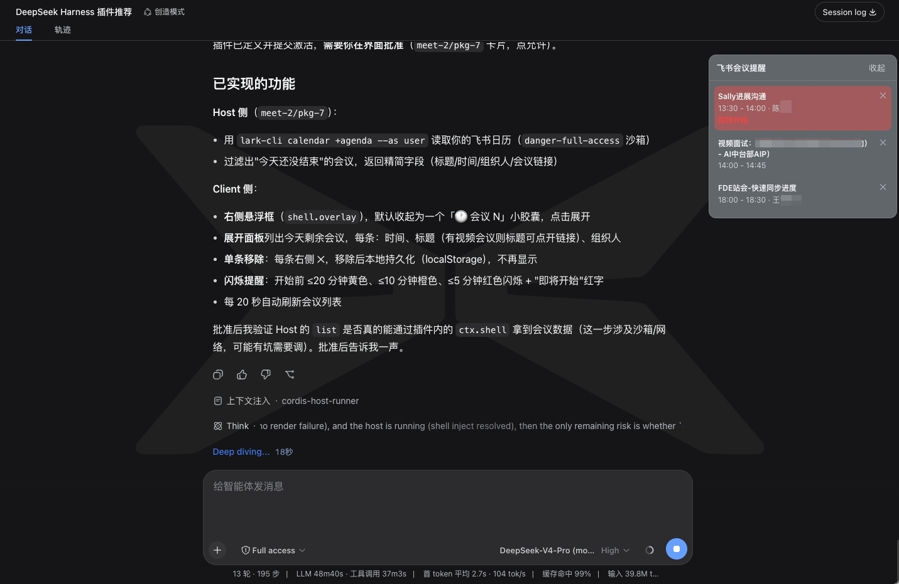

<div align="center">



# dsh-lark-meeting-notifier · 飞书会议提醒

> 这个插件只有副作用：在你跟 AI 聊得神魂颠倒的时候，提醒你「不得不去跟碳基生命开会了」。

[](LICENSE)
[](https://github.com/topics/dsh-plugin)
[](https://www.feishu.cn/)
[](https://www.larksuite.com/)

</div>

一个 DeepSeek Harness（DSH）插件：在工作区右侧显示一个可展开/收起的悬浮框，列出**今天剩余的飞书会议**，让你埋头写代码时不会错过会议。

- 会议室名称（从飞书日历的「会议室」资源参会人读取）
- 多闹钟提醒：每个提醒提前量独立触发，开始前到点闪烁（黄/橙/红随紧迫度）
- 点击会议记录关闭当前提醒（关闹钟）；可开启「30 秒后自动停止闪烁」
- 提醒触发时自动展开面板（可关）
- 单条「✕」移除提醒（本地持久化，不会动飞书日历里的真实日程）
- 开始时间已过的会议自动移除；今日会议清空时可查看「明日」会议
- 配置持久化，设置面板可调

---

## 安装

```bash
dsh plugin --profile web add github:yeruizhi/dsh-lark-meeting-notifier
```

然后重启 `dsh web`（或 `npx @deepseek-ai/dsh web`）。页面右侧会出现「🕐 会议」小胶囊。

## 前置条件：lark-cli 安装与授权

本插件通过 [`@larksuite/cli`](https://www.npmjs.com/package/@larksuite/cli)（命令名 `lark-cli`）读取飞书日历。

### 1. 安装 lark-cli

```bash
npm install -g @larksuite/cli
```

验证：`lark-cli --version` 应输出 `lark-cli version x.y.z`。

### 2. 初始化应用配置

```bash
lark-cli config init
```

按提示完成应用配置（打开授权链接或扫描二维码）。

### 3. 授权日历读取权限（user 身份，最小 scope）

```bash
lark-cli auth login --scope "calendar:calendar:readonly"
```

> 必须使用 user 身份（`--as user`），bot 身份看不到个人日历。

### 4. 验证

```bash
lark-cli auth status --json --verify
```

确认 `identity` 为 `user`、`verified` 为 `true`。

---

## 使用

- **展开/收起**：点击右侧「🕐 会议 N」胶囊。
- **会议条目**：时间段、标题（有视频会议可点击打开）、组织人、会议室。
- **关闭提醒**：会议闪烁时点击该条目（关闹钟）。
- **移除提醒**：点条目右侧 ✕。
- **明日**：今日会议清空时，展开面板头部出现「明日」，点击加载明天的会议。

## 配置（设置 → 飞书会议提醒）

| 配置项 | 说明 | 默认 |
| --- | --- | --- |
| 提醒提前时间 | 多选（分钟），每个是一个独立闹钟 | 20、10、5 |
| 30 秒后自动停止闪烁 | 开关 | 开 |
| 提醒时自动展开 | 开关 | 开 |
| 刷新间隔 | 30 / 60 / 120 秒 | 30 秒 |
| 会议室名显示 | 完整 / 简短 | 完整 |

---

## 故障排查

| 现象 | 原因 | 解决 |
| --- | --- | --- |
| 面板显示「lark-cli 未安装」 | 缺少 `@larksuite/cli` | `npm install -g @larksuite/cli` |
| 面板显示「飞书未授权或缺少日历权限」 | 未授权 / scope 缺失 / 登录态过期 | `lark-cli auth login --scope "calendar:calendar:readonly"` |
| 列表为空 | 今天确实没有剩余会议 | `lark-cli calendar +agenda --as user` 核对 |

## 技术要点（二次开发参考）

- 数据源：`lark-cli calendar +agenda --as user`（今日日程列表）
- 会议室名：`lark-cli calendar events get --calendar-id primary --event-id <id> --need-attendee`，取 `type=resource` 参会人的 `display_name`
  - 重复日程实例用 `recurring_event_id`，例外实例用 `event_id`
- Host 内执行 lark-cli 需 `sandboxPolicy: { mode: 'danger-full-access' }`（读配置 + 联网）
- Client↔Host 通信：Host 注册 webServer 路由（`/dsh-lark-meeting/list`、`/health`），Client 用 `fetch` 拉取

## License

MIT
